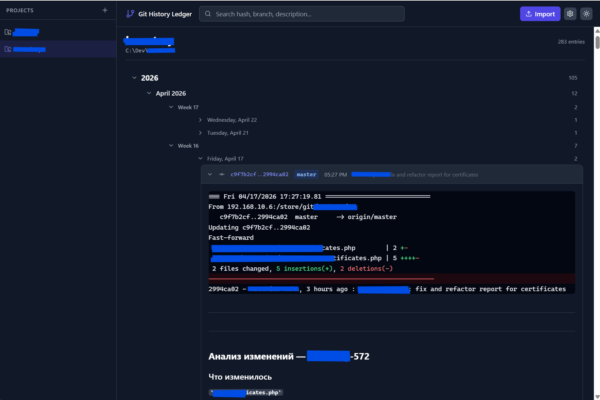
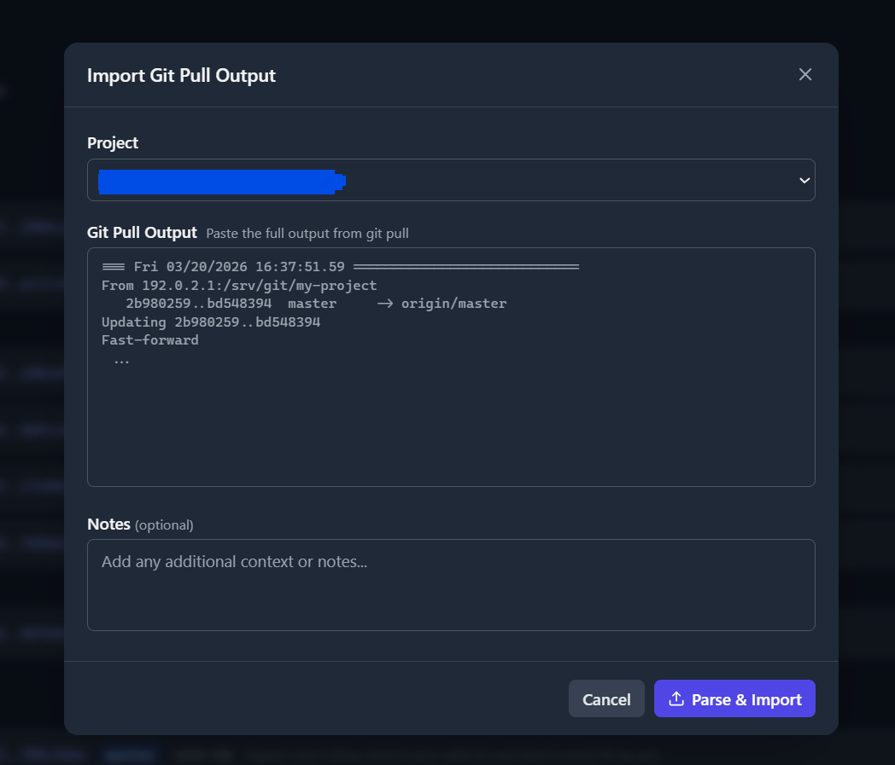
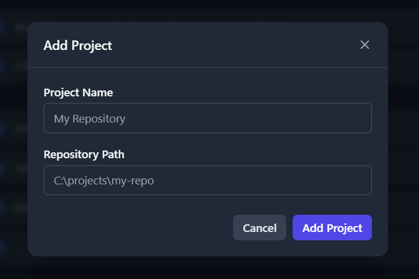
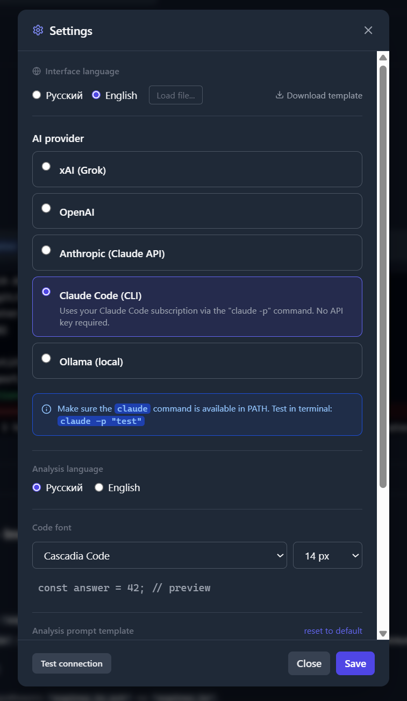

# Git History Ledger

[](LICENSE)
[](https://nodejs.org/)
[](https://react.dev/)

A local web app that turns raw `git pull` output into a searchable, AI-annotated change journal.  
Paste or auto-pull from your repositories — get a structured, browsable history with Markdown notes and AI summaries.



---

## Features

- **Import git pull output** — paste manually or trigger `git pull` directly from the UI
- **Import git log history** — select commits by date range with a preview list and per-commit AI analysis
- **Auto-analyze after import** — optional AI summary generated immediately on import
- **Gap detection** — scan for commits that exist in the repo but are missing from the journal; one-click catch-up import
- **Tree view** — commits grouped by Year → Month → Week → Day
- **AI analysis** — automatic summaries via xAI, OpenAI, Anthropic, Claude Code CLI, or Ollama (local)
- **Chat with commits** — ask follow-up questions about any change
- **Markdown editor** — rich description and notes fields with live preview
- **Diff syntax highlighting** — colored `+`/`-` lines, file stats, commit ranges; long bodies auto-collapsed with expand toggle
- **Open on GitHub/GitLab** — link icon next to each commit hash; remote URL auto-detected on project creation
- **Full-text search** — across hash, branch, description, and notes
- **Path validation & git clone** — detects missing or non-git directories when adding a project and offers to clone right from the UI
- **MCP server** — connect to Claude Code, Claude Desktop, Cursor, Windsurf, Cline, or any MCP-compatible client
- **Multilingual UI** — built-in Russian and English; load any custom `.json` language file
- **Dark / light theme** — persisted across sessions
- **Customizable code font** — system, Cascadia Code, JetBrains Mono, Fira Code, and more

---

## Screenshots

| Import | Add Project | Settings |
|--------|-------------|----------|
|  |  |  |

---

## Quick Start

```bash
# 1. Clone the repository
git clone https://github.com/Wasya/Git-History-Ledger.git
cd Git-History-Ledger

# 2. Install all dependencies
npm run install:all

# 3. Configure the backend (copy the example, edit if needed)
cp backend/config.example.json backend/config.json

# 4. Start backend + frontend
npm run dev
```

Open **http://localhost:5173** in your browser.  
The backend API runs at **http://localhost:3001**.

---

## Git Pull Input Format

The parser expects the output of a **wrapper script** that prepends a timestamp header to `git pull`:

```
=== Fri 03/20/2026 16:37:51.59 ============================
From 192.0.2.1:/srv/git/my-project
   2b980259..bd548394  master     -> origin/master
Updating 2b980259..bd548394
Fast-forward
 src/core/config.py | 2 +-
 1 file changed, 1 insertion(+), 1 deletion(-)
```

**Windows batch wrapper example:**

```bat
@echo off
echo === %date% %time% ============================
git -C "C:\projects\my-repo" pull
```

You can also trigger `git pull` directly from the sidebar (with or without AI analysis) — the wrapper header is added automatically.

---

## Git Log Import

In addition to `git pull` output, you can import **historical commits** directly from a repository.

Open **Import → Import git log** in the top bar. Two modes are available:

- **Auto** — pick a date range, click **Preview**, select the commits you want, and import. GitLed fetches the log from the repository path configured for the project and skips duplicates automatically.
- **Paste** — paste raw `git log` output and click **Import**.

Both modes support **Analyze after import** — each imported commit is sent to AI immediately after being saved.

The display format for imported commits matches the standard `git pull` view: file stats only (no full diff lines), keeping the journal readable.

---

## Automating Import from Build Scripts

Instead of pasting git pull output manually, you can **POST it directly to the API** from any build script. This lets you wire up GitLed as a passive observer of your CI/build pipeline — every pull is recorded automatically.

### How it works

```
POST http://localhost:3001/api/commits
Content-Type: application/json

{
  "project_id": 1,
  "raw_text": "=== Mon 04/28/2026 12:00:00 ============================\n<git pull output>"
}
```

The `raw_text` field must start with the `=== date ===` header so the parser can extract the timestamp. Find your `project_id` with:

```bash
curl http://localhost:3001/api/projects
```

### Ready-made scripts

Drop-in import scripts are provided in [`docs/scripts/`](docs/scripts/):

| Script | Platform |
|---|---|
| [`gitled-import.ps1`](docs/scripts/gitled-import.ps1) | Windows (PowerShell) |
| [`gitled-import.sh`](docs/scripts/gitled-import.sh) | Linux / macOS (bash + python3) |

Both scripts are silent when GitLed is not running — they won't break your build.

### Windows CMD + PowerShell example

If your build script also captures a commit details line (hash / author / message) into a separate log file, pass it via `-CommitLog` so GitLed can parse the full commit info. Make sure the import runs **after** any scripts that produce that file:

```bat
@echo off
cd C:\projects\my-repo

git pull > git_pull.log 2>&1
findstr /i /c:"Already up to date." git_pull.log >nul
if "%ERRORLEVEL%"=="0" (
    del git_pull.log 2>nul
    exit /b
)

:: Run build / commit scripts that produce git_pull_commit.log
call C:\scripts\AddCommits.cmd

:: Import into GitLed (silently skipped if server is not running)
powershell -NoProfile -ExecutionPolicy Bypass ^
    -File "C:\path\to\gitled-import.ps1" ^
    -PullLog "git_pull.log" ^
    -CommitLog "git_pull_commit.log" ^
    -ProjectId 1

:: ... your build commands here
```

The `-CommitLog` parameter is optional. When provided, its content is appended to the payload so the parser can extract the commit hash, author, and subject line.

### Linux / macOS bash example

```bash
#!/usr/bin/env bash
cd /srv/projects/my-repo

git pull > git_pull.log 2>&1
grep -qi "Already up to date." git_pull.log && { rm git_pull.log; exit 0; }

# Import into GitLed
bash /path/to/gitled-import.sh git_pull.log 1

# ... your build commands here
```

---

## AI Analysis

Configure an AI provider in **Settings → AI provider**:

| Provider | Requires | Notes |
|---|---|---|
| **Claude Code (CLI)** | Claude Code subscription | ⭐ Recommended — best analysis quality |
| Anthropic (Claude API) | API key | Excellent results with default prompt |
| xAI (Grok) | API key | Requires a different prompt style (see below) |
| OpenAI | API key | Works well; short direct prompts preferred |
| Ollama (local) | Running Ollama instance | Quality depends on model; Qwen2.5 recommended |

AI generates a Markdown summary of each pull or commit. You can also open a **chat** on any commit to ask follow-up questions. The prompt template is fully customizable in Settings.

> **Note:** This app was developed and tested primarily with **Claude Code (CLI)**, which produces the most detailed and context-aware analyses. The default prompt template is designed for Claude and may not work well with other models without adjustment — see [Prompt Templates](#prompt-templates) below.

---

## Prompt Templates

The default prompt template is tuned for **Claude**. Different AI models interpret prompt structure very differently, which leads to dramatically different output quality.

**Claude** treats structured Markdown headers as an output template to fill in.  
**Grok / GPT** often treats the same headers as a to-do list to explain and paraphrase — resulting in verbose, instruction-restating output instead of actual code analysis.

Ready-made templates for each provider are in [`docs/prompts/`](docs/prompts/):

| File | Provider | Language |
|---|---|---|
| [`analysis-prompt-ru.md`](docs/prompts/analysis-prompt-ru.md) | Claude Code (CLI) | Russian |
| [`analysis-prompt-en.md`](docs/prompts/analysis-prompt-en.md) | Claude Code (CLI) | English |
| [`analysis-prompt-xai-ru.md`](docs/prompts/analysis-prompt-xai-ru.md) | xAI Grok / OpenAI / Ollama | Russian |
| [`analysis-prompt-xai-en.md`](docs/prompts/analysis-prompt-xai-en.md) | xAI Grok / OpenAI / Ollama | English |

The **Claude Code CLI** templates include a full workflow: fetch the diff, match records in GitLed, write analysis, and save via API — all through bash commands.

The **xAI / OpenAI / Ollama** templates use a minimal, direct imperative style that works better with models that tend to over-explain structured instructions. If you switch providers, copy the matching template into **Settings → Analysis prompt template**.

---

## Multilingual UI

The interface ships with **Russian** and **English** built in.  
To add another language:

1. Open Settings → **Download template** — downloads the current locale as `.json`
2. Translate the strings
3. Settings → **Load file...** — applies the new language instantly

The JSON format is simple and human-readable — no build step needed.

---

## Configuration

`backend/config.json` is created from `config.example.json` and stores your personal settings (AI provider, API key, custom prompt, font preferences). It is **gitignored** and never committed.

| Field | Description |
|---|---|
| `ai_provider` | `xai` / `openai` / `anthropic` / `claude_cli` / `ollama` |
| `ai_api_key` | API key (empty for Claude CLI and Ollama) |
| `ai_model` | Model name, e.g. `gpt-4o-mini` |
| `ai_base_url` | Custom base URL (required for Ollama, optional for others) |
| `ai_prompt_lang` | Default analysis language: `ru` or `en` |
| `ai_prompt_custom` | Custom prompt template (supports `{projectName}`, `{projectPath}`, `{gitOutput}`) |
| `font_mono` | Monospace font CSS value |
| `font_size` | Code font size in px |

---

## Tech Stack

| Layer | Technology |
|---|---|
| Frontend | React 18, Vite, Tailwind CSS, react-markdown |
| Backend | Node.js, Express, better-sqlite3 |
| Database | SQLite (`backend/ledger.db`, auto-created) |
| AI | Fetch-based calls to OpenAI-compatible APIs + Anthropic + Claude CLI |

---

## Database Schema

| Table | Fields |
|---|---|
| `projects` | `id`, `name`, `path`, `created_at` |
| `commits` | `id`, `project_id`, `commit_date`, `branch`, `commit_hash`, `raw_output`, `description`, `notes`, `created_at` |

`ON DELETE CASCADE` — deleting a project removes all its commits.

---

## REST API

Base URL: `http://localhost:3001`

```
GET    /api/projects
POST   /api/projects
DELETE /api/projects/:id

GET    /api/projects/:id/log-preview?from=YYYY-MM-DD&to=YYYY-MM-DD
POST   /api/projects/:id/pull        ← git pull + optional AI analysis

GET    /api/commits?project_id=&search=
POST   /api/commits                  ← import from raw_text (build scripts)
PUT    /api/commits/:id
DELETE /api/commits/:id
POST   /api/commits/:id/ask          ← AI chat
POST   /api/commits/:id/analyze      ← (re-)analyze with AI
POST   /api/commits/import-log       ← import by commit hashes or raw git log

GET    /api/settings
PUT    /api/settings
POST   /api/settings/test            ← test AI connection
GET    /api/settings/providers
GET    /api/settings/default-prompts
GET    /api/settings/ollama-models
```

---

## MCP Server

`mcp-server.js` exposes Git History Ledger as an [MCP](https://modelcontextprotocol.io) server. Any MCP-compatible AI client (Claude Code, Claude Desktop, Cursor, Windsurf, Cline, Continue.dev, Zed, etc.) can query and update your commit journal directly during a conversation — without opening the web UI.

### Available tools

| Tool | Description |
|---|---|
| `gitled_projects` | List all registered repositories (id, name, path) |
| `gitled_commits` | Search commit history — filter by project, text, date range |
| `gitled_commit` | Get full details of a single commit (description, diff, notes) |
| `gitled_update_notes` | Append or replace the notes field of a commit |
| `gitled_pull` | Trigger git pull on a project and import new commits |
| `gitled_gaps` | Find commits in the repo that are not yet in the journal |

The server reads SQLite directly (no backend required for reads). `gitled_pull` and `gitled_gaps` proxy through the REST backend — start `npm run dev` first for those tools to work.

### Connect to Claude Code

Add to your project settings (`.claude/settings.json`) or globally (`~/.claude/settings.json`):

```json
{
  "mcpServers": {
    "gitled": {
      "command": "node",
      "args": ["C:\\OTbase\\GitLed\\mcp-server.js"]
    }
  }
}
```

### Connect to Claude Desktop

Add to `claude_desktop_config.json` (Windows: `%APPDATA%\Claude\claude_desktop_config.json`):

```json
{
  "mcpServers": {
    "gitled": {
      "command": "node",
      "args": ["C:\\OTbase\\GitLed\\mcp-server.js"]
    }
  }
}
```

Restart Claude Desktop after saving. The `gitled_*` tools will appear in the tools list automatically.

### Connect to Cursor / Windsurf / Cline

The MCP config key is the same (`mcpServers`) — only the config file location differs:

| Client | Config file |
|---|---|
| Cursor | `.cursor/mcp.json` in project root, or `~/.cursor/mcp.json` globally |
| Windsurf | `.windsurf/mcp.json` in project root, or `~/.windsurf/mcp.json` globally |
| Cline (VS Code) | VS Code settings → Cline → MCP Servers |
| Continue.dev | `.continue/config.json` → `mcpServers` block |

---

## License

[MIT](LICENSE) © 2026 Andrey Koshevarov

---

---

## На русском

**Git History Ledger** — локальное веб-приложение для ведения журнала изменений Git-репозиториев.

Импортирует вывод `git pull`, парсит его по сессиям, сохраняет в SQLite и отображает в виде дерева с поиском, Markdown-редактором и AI-анализом.

### Быстрый старт

```bash
git clone https://github.com/Wasya/Git-History-Ledger.git
cd Git-History-Ledger
npm run install:all
cp backend/config.example.json backend/config.json
npm run dev
```

Открыть **http://localhost:5173**.

### Основные возможности

- Импорт вывода `git pull` — вручную или прямо из интерфейса
- Импорт истории коммитов из `git log` — выбор по диапазону дат с предпросмотром и AI-анализом каждого коммита
- Автоматический AI-анализ сразу после импорта
- **Поиск пропусков** — сканирует репозиторий на коммиты, которых нет в журнале; импорт в один клик
- Дерево коммитов: Год → Месяц → Неделя → День
- AI-анализ изменений (xAI, OpenAI, Anthropic, Claude Code CLI, Ollama)
- Чат с коммитом — задавай уточняющие вопросы об изменениях
- Markdown-редактор описаний и заметок
- Подсветка синтаксиса diff; длинные тела коммитов сворачиваются с кнопкой раскрытия
- **Открыть на GitHub/GitLab** — иконка-ссылка у каждого хэша; remote URL определяется автоматически
- Полнотекстовый поиск
- **Валидация пути и git clone** — при добавлении проекта определяет отсутствующую или не-git папку и предлагает склонировать прямо из интерфейса
- **MCP-сервер** — подключается к Claude Code, Claude Desktop, Cursor, Windsurf, Cline и любому MCP-клиенту
- Мультиязычный интерфейс — RU/EN встроены, поддержка кастомных JSON-файлов локализации
- Тёмная и светлая тема
- Настройка шрифта кода

### Импорт истории коммитов

Помимо вывода `git pull`, можно импортировать **историю коммитов** прямо из репозитория.

Откройте **Import → Import git log** в верхней панели. Доступны два режима:

- **Auto** — задай диапазон дат, нажми **Preview**, отметь нужные коммиты и импортируй. GitLed получает лог из пути репозитория, настроенного для проекта, и автоматически пропускает дубликаты.
- **Paste** — вставь вывод `git log` вручную и нажми **Import**.

В обоих режимах доступен флаг **Analyze after import** — каждый импортированный коммит сразу отправляется на AI-анализ.

Формат отображения импортированных коммитов совпадает с обычным видом `git pull`: только статистика по файлам, без полного diff — журнал остаётся читаемым.

### Автоматический импорт из билд-скриптов

Вместо ручной вставки вывода `git pull` можно отправлять его напрямую в API из любого скрипта сборки:

```
POST http://localhost:3001/api/commits
Content-Type: application/json
{ "project_id": 1, "raw_text": "=== дата ===\n<вывод git pull>" }
```

Готовые скрипты — в папке [`docs/scripts/`](docs/scripts/):
- [`gitled-import.ps1`](docs/scripts/gitled-import.ps1) — Windows PowerShell
- [`gitled-import.sh`](docs/scripts/gitled-import.sh) — Linux / macOS

Если GitLed не запущен — скрипты молча пропускают импорт и не ломают сборку.

Если билд-скрипт сохраняет строку с хешем/автором/сообщением коммита в отдельный файл, передай его через параметр `-CommitLog` — парсер извлечёт полную информацию о коммите. Важно вызывать скрипт импорта **после** скриптов, которые создают этот файл:

```bat
:: Сначала выполнить сборку/коммит-скрипты, которые создадут git_pull_commit.log
call C:\scripts\AddCommits.cmd

:: Затем импортировать в GitLed
powershell -NoProfile -ExecutionPolicy Bypass ^
    -File "C:\path\to\gitled-import.ps1" ^
    -PullLog "git_pull.log" ^
    -CommitLog "git_pull_commit.log" ^
    -ProjectId 1
```

Параметр `-CommitLog` необязателен.

### AI-провайдеры

| Провайдер | Требует | Заметки |
|---|---|---|
| **Claude Code (CLI)** | Подписка Claude Code | ⭐ Рекомендуется — лучшее качество анализа |
| Anthropic (Claude API) | API ключ | Отличные результаты с дефолтным промптом |
| xAI (Grok) | API ключ | Требует другой стиль промпта (см. ниже) |
| OpenAI | API ключ | Работает хорошо; предпочтительны короткие промпты |
| Ollama (локальный) | Запущенный Ollama | Качество зависит от модели; рекомендуется Qwen2.5 |

Приложение разработано и протестировано прежде всего с **Claude Code (CLI)**, который даёт наиболее детальный и контекстный анализ. Дефолтный промпт настроен под Claude.

### Шаблоны промптов

Разные AI-модели кардинально по-разному интерпретируют структуру промпта:

**Claude** воспринимает заголовки Markdown как шаблон для заполнения.  
**Grok / GPT** нередко воспринимают те же заголовки как список задач для пересказа — и вместо анализа кода начинают пересказывать сами инструкции.

Готовые шаблоны под каждый провайдер — в папке [`docs/prompts/`](docs/prompts/):

| Файл | Провайдер | Язык |
|---|---|---|
| [`analysis-prompt-ru.md`](docs/prompts/analysis-prompt-ru.md) | Claude Code (CLI) | Русский |
| [`analysis-prompt-en.md`](docs/prompts/analysis-prompt-en.md) | Claude Code (CLI) | English |
| [`analysis-prompt-xai-ru.md`](docs/prompts/analysis-prompt-xai-ru.md) | xAI Grok / OpenAI / Ollama | Русский |
| [`analysis-prompt-xai-en.md`](docs/prompts/analysis-prompt-xai-en.md) | xAI Grok / OpenAI / Ollama | English |

При смене провайдера скопируй содержимое нужного шаблона в **Settings → Analysis prompt template**.

### MCP-сервер

`mcp-server.js` подключает Git History Ledger как [MCP](https://modelcontextprotocol.io)-сервер. Любой MCP-совместимый AI-клиент (Claude Code, Claude Desktop, Cursor, Windsurf, Cline, Continue.dev, Zed и др.) может читать и обновлять журнал коммитов прямо в разговоре, без открытия веб-интерфейса.

#### Доступные инструменты

| Инструмент | Описание |
|---|---|
| `gitled_projects` | Список зарегистрированных репозиториев (id, имя, путь) |
| `gitled_commits` | Поиск по истории коммитов — фильтр по проекту, тексту, дате |
| `gitled_commit` | Полные данные одного коммита (описание, diff, заметки) |
| `gitled_update_notes` | Добавить или заменить заметки к коммиту |
| `gitled_pull` | Выполнить git pull и импортировать новые коммиты |
| `gitled_gaps` | Найти коммиты в репозитории, которых ещё нет в журнале |

Сервер читает SQLite напрямую — бэкенд не нужен для чтения. Инструменты `gitled_pull` и `gitled_gaps` обращаются к REST-серверу — перед их использованием запусти `npm run dev`.

#### Подключение к Claude Code

Добавь в настройки проекта (`.claude/settings.json`) или глобально (`~/.claude/settings.json`):

```json
{
  "mcpServers": {
    "gitled": {
      "command": "node",
      "args": ["C:\\OTbase\\GitLed\\mcp-server.js"]
    }
  }
}
```

#### Подключение к Claude Desktop

Добавь в `claude_desktop_config.json` (Windows: `%APPDATA%\Claude\claude_desktop_config.json`):

```json
{
  "mcpServers": {
    "gitled": {
      "command": "node",
      "args": ["C:\\OTbase\\GitLed\\mcp-server.js"]
    }
  }
}
```

После сохранения перезапусти Claude Desktop. Инструменты `gitled_*` появятся в списке автоматически.

#### Подключение к Cursor / Windsurf / Cline

Ключ конфига тот же (`mcpServers`) — меняется только расположение файла:

| Клиент | Файл конфигурации |
|---|---|
| Cursor | `.cursor/mcp.json` в корне проекта или `~/.cursor/mcp.json` глобально |
| Windsurf | `.windsurf/mcp.json` в корне проекта или `~/.windsurf/mcp.json` глобально |
| Cline (VS Code) | Настройки VS Code → Cline → MCP Servers |
| Continue.dev | `.continue/config.json` → блок `mcpServers` |

### Лицензия

[MIT](LICENSE) © 2026 Andrey Koshevarov
